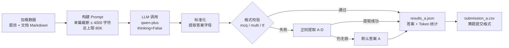
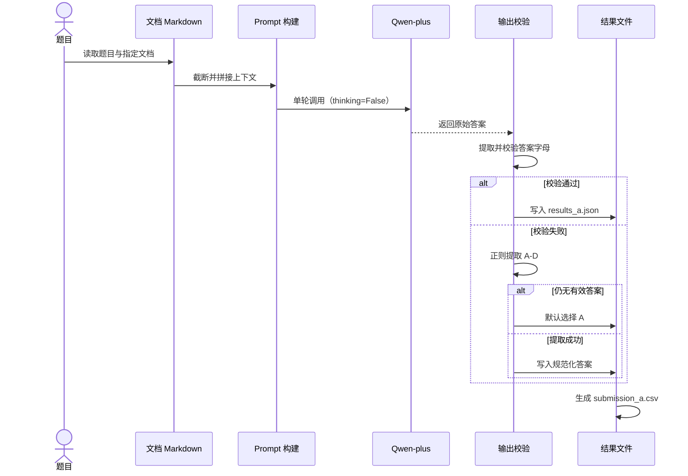
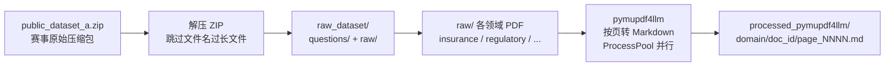

# 金融长文本 Agent 的动态记忆压缩与高效问答

> 本版仅保留与赛题直接相关的正文、公式、表格、流程图和策略；封面、目录、品牌宣传、二维码和 Q&A 页面已省略。
> 图表重绘部分为基于原 PDF 的 Mermaid/Markdown 语义版，原始视觉效果仍以 PDF 为准。

## PDF 第 4 页

赛事概览与核心约束
赛题核心设定
- 数据:200题,五大金融领域
.基座模型:仅限 Qwen 系列,禁止微调/reasoning
.禁止 Embedding 和 Rerank 模型(经赛题方确认)
- Token 预算:全部接口调用总和≤500 万
- 评测:准确率70%+Token 效率30%
核心挑战
A榜vS B榜差异
A 榜提供 doc_ids,B榜需自行检索定位

关键数据
200
总题目数
500万
Token 预算上限
无向量检索
Embedding/Rerank 不可用,退回规则方法
五类文档差异巨大
保险/法规/合同/报表/研报,结构各异
核心洞察:多数agent 的失败,根源在上下文工程的失败,而非模型能力的不足。给定固定模型和token 预算,怎么让模型读最少但最对的信息,是关键问题。
领域
保险条款
监管法规
金融合同
财务报表
行业研报
文档数
16
26
14
10
20
题目数
20
20
20
20
20
核心考查点
保险金计算、退保金额、等待期、免责条款
法条引用、合规义务、跨文档对比
债券条款、发行信息、信用评级条件
年报指标、经营现金流、研发投入
趋势判断、公司对比、数据核验

### 图表重绘：五大领域分布

| 领域 | 文档数 | 题目数 | 核心考查点 |
| --- | ---: | ---: | --- |
| 保险条款 | 16 | 20 | 保险金计算、退保金额、等待期、免责条款 |
| 监管法规 | 26 | 20 | 法条引用、合规义务、跨文档对比 |
| 金融合同 | 14 | 20 | 债券条款、发行信息、信用评级条件 |
| 财务报表 | 10 | 20 | 年报指标、经营现金流、研发投入 |
| 行业研报 | 20 | 20 | 趋势判断、公司对比、数据核验 |

---

---

## PDF 第 5 页

评测公式与 Token 投入策略
评分公式
FinalScore = 100 x Acc x (0.7+ 0.3x TokenScore)
TokenScore = max(0,(500万- T_used)/500万)线性递减

核心结论
| TokenScore是线性的,不存在拐点
每省1个token 的边际收益完全一样,不必焦虑 token 效率
|花token 答对题,永远是赚的
即使在90% 准确率场景,答对一题上限仍有13万 token
1 Token 耗尽后可 all-in 准确率
TokenScore 归零后不再降,所有提准确率操作都值得做

决策原则:准确率从17% 80% 贡献63分;TokenScore 从 0.28 -0.93仅贡献约20%。把精力花在准确率上,ROI 高得多。

### 图表重绘：评分公式与 Token 预算

```text
FinalScore = 100 × Acc × (0.7 + 0.3 × TokenScore)
TokenScore = max(0, (500 万 - T_used) / 500 万)
```

| 当前状态 | Acc | TokenScore | 单题 Token 上限 |
| --- | ---: | ---: | ---: |
| 刚起步 | 20% | 0.9 | 77 万 |
| 中等水平 | 50% | 0.7 | 30 万 |
| 接近极限 | 90% | 0.1 | 13 万 |

---

---

## PDF 第 6 页

题目输入格式与字段说明
JSON 输入示例

"'qid": "fin_a_001",
"domain": "financial_reports",
"'question"."研发投入占营收比例?”,
"options": {"A": "5.2%", "B": "8.7%"),
"'answer_format":"mcg",
"type":"事实查找",
"doc_ids":["doc_03", "doc_07"]
关键字段说明
字段
qid
domain
answer_format
type
doc_ids
options
类型
String
String
String
String
Array
Object
说明
唯一编号:{domain}_{split}_{序号}
五大领域之一
mcq(单选)/multi(多选)/tf(判断)
题目能力标签(因领域质量差异大)
参考文档编号,A榜提供B榜不提供
四个选项,键为A/B/C/D
输出格式:answers.csv
summary,5000000,1234567,0
fin_a_001,A,900,2,902
fin_a_002,BC,850,3,853
.首行为汇总:summary.预算,已用,未用
- 单选:单个字母(A);多选:字母排序连写(BC)
- 判断:T或F;token 统计覆盖所有模型接口调用
A榜vsB榜关键差异:A榜提供 doc_ids(已知答案所在文档,可离线深度预处理)一B榜不提供doc_ids(需自行检索定位候选文档,难度更高)

### 图表重绘：输入输出字段

| 字段 | 类型 | 说明 |
| --- | --- | --- |
| `qid` | String | 唯一编号：`{domain}_{split}_{序号}` |
| `domain` | String | 五大领域之一 |
| `answer_format` | String | `mcq`（单选）/ `multi`（多选）/ `tf`（判断） |
| `type` | String | 题目能力标签 |
| `doc_ids` | Array | 参考文档编号；A 榜提供，B 榜不提供 |
| `options` | Object | 四个选项，键为 A/B/C/D |

---

---

## PDF 第 7 页

Baseline 整体流程
端到端 Baseline 方案流程图
加载数据
题目+文档 Markdown

构建 Prompt
单篇截断≤4000字符
总上限320K
LLM 调用
qwen-plus
thinking=False
标准化
提取字母
格式校验
mcq/multi/tf
失败
正则提取
A-D
仍无效
通过
results_a.json
答案+Token统计
关键参数与降级策略
模型配置:qwen-plus,thinking=False
截断策略:单篇截断 ≤4000字符,总上限 80K
降级机制:格式校验失败一正则提取 A-D 一仍无效则默认选A
输出格式:results_a.json(答案+Token 统计)一submission_a.csv
Baseline 定位:先跑通、再优化的最小可行方案
.无复杂检索:直接加载题目+文档 Markdown
- 无分块处理:硬截断保证上下文完整性
- 无题型路由:所有题目统一走同一管线
Baseline 的意义:建立可运行的最小闭环,在此基础上叠加检索优化、题型路由、记忆压缩等策略,逐步逼近上限。

默认A
submission a.csv
赛题提交格式

### 图表重绘：Baseline 整体流程



#### 按时间顺序表达



---

---

## PDF 第 8 页

Baseline Token 消耗分析
核心数据概览(100题A榜)
总 Token 消耗
376,836
占500万预算的7.5%
Prompt Token 分布特征
统计项
最小 Prompt
中位数
最大 Prompt
超过 4K 的题数
数值
211
1,952
7,088
23 /100

平均每题消耗
3,768
Prompt 2,403 + Completion 1,365
剩余预算
462万+
还有 92.5%的预算空间可用
说明
短文档/简单题,几乎无上下文
一半题目 prompt 不到2000
多文档题叠加导致
仅少数多文档题触发截断
关键洞察
1.Token 使用非常克制
48 题集中在1000-2000 token 区间,多数文档不长,4000 截断很少触发
2. 预算利用率极低
只用了 7.5%,大量空间可加检索、多轮推理、自检等策略
3. 多文档题是消耗大头
仅23题超过 4Ktoken,这些是需要重点优化的场景
结论:Baseline 的token 消耗极其保守,准确率提升的空间远大于token 预算的约束。放心加策略。

---

---

## PDF 第 10 页

五大金融文档领域与题型特征
领域
文档
保险条款

监管法规
26
金融合同
14
财务报表

行业研报
20
五种题目能力标签
国公式计算
提取公式代入参数计算
题目
20
20
20
20
20
文档特征
条款密集、数字精确、结构规整
法条编号、跨文档引用、表述严谨
结构化条款、财务术语密集
表格密集、数字精确、年度对比
长篇论述、趋势分析、观点混合

对比多份文档同类数据
考查要点
保险金计算、退保金额、等待期、免责条款
法条引用、合规义务、跨文档对比
债券条款、发行信息、信用评级条件
年报指标、经营现金流、研发投入
趋势判断、公司对比、数据核验
联合推理
多文档信息拼合综合判断

关键判断:每种类型对检索精度和上下文结构的要求不同,不能使用同一套提示词模板和检索策略处理所有题目。需按题型路由差异化处理。

---

---

## PDF 第 11 页

PDF 解析方案与检索策略
PDF解析方案对比
方案
PyMuPDF

MinerU
优势
纯CPU、毫秒级/页、速度快
VLM+OCR 双模型、扫描件友好
局限
无OCR、表格还原度一般
需GPU、架构复杂
适用文档
保险条款、监管法规(文本为主)
财务报表、金融合同(表格密集)
检索策略(无 Embedding/Rerank)
A正刻匹配
精确匹配数字、百分比、日期、条款编号,零
token
A BM25 关键词
词频统计相关性排序,纯CPU,中文分词后稳
定
文档结构定位
利用标题层级、条款编号、页码精确定位
元数据预筛选
按领域、文档标识、页码范围过滤
A榜专属优化
已知 doc_ids 一离线深度结构化提取一零token 消耗:条款编号映射表/财务指标结构化表/法条引用关系图
关于分块:agent 自带 grep 工具可直接全文关键词定位。BM25+滑动窗口提取不需分块;保留文档结构时按条款/章节自然边界切分即可,不必纠结块大小。

---

---

## PDF 第 12 页

数据预处理管线
从原始压缩包到结构化 Markdown 的全流程

public_dataset_a.zip
赛方原始压缩包
解压ZIP
跳过文件名过长文件
数据预处理管线
raw_dataset/
questions/+raw/
raw/下各领域 PDF
insurance/regulatory...
pymupdfalm
按页转Markdown
ProcessPool 并行
关键设计决策
解析工具:pymupdf4llm,纯CPU,按页转 Markdown
并行处理:ProcessPool 并行加速,多领域同时处理
输出结构:processed_pymupdf4llm/domain/doc_id/page_NNNN.md
A 榜优势:已知 doc_ids,可离线深度预处理,零 Token 消耗
预处理的价值:
- 将 PDF 转为结构化 Markdown,保留文本和表格
. 按页拆分便于后续精准检索和片段提取
- 离线完成,不消耗500万 Token 预算
核心原则:预处理是离线投资——花一次时间解析所有文档,答题阶段才能精准检索、高效调用。

### 图表重绘：数据预处理管线



---

---

## PDF 第 14 页

03 题型分类与问答策略/3.1题型分类与路由

题型分类与路由策略
推理类型
直接事实查找
条款定位+判断
公式计算
跨文档对比
多文档联合推理
type 字段质量因领域而异
领域
insurance
regulatory
contracts/reports
特征
答案在文档中明确定义
答案分散在条款多处
需提取公式和参数执行计算
对比多份文档同类数据
多份文档信息拼合综合判断

推荐策略
精准检索+直接输出,不需要推理链
多片段检索+逐项验证
简单运算直接推理;复杂计算(多位数乘除、链式百分比) Python执行
分文档检索+结构化提取+代码计算
多文档检索+逐条件验证+逻辑归并

type 实际内容
事实查询、推理判断、比较分析、计算题
多选题、判断、mcq、tf(纯冗余)
混合:部分格式+部分领域标签
可用性
V可信
X冗余
丕需区分
处理建议
可直接映射到推理类型分类
忽略,与 answer_format 完全一致
结合 answer_format 和题目文本自行判定
路由原则:有计算的必须走代码,纯判断走大模型;多选题和联合推理出错率更高,优先分配自检 token。

---

---

## PDF 第 15 页

检索策略与提示词优化
理想管线:四步流程

离线解析
结构化预处理
提示词优化核心技巧
选项前置
模型对上下文前部注意力更高,先看到选项再读文档匹配精度更好
输出极简
严格约束输出为纯答案字母,省掉推理链 token(复杂题可保留)
系统提示词归零
能不放系统提示词就不放,每道题重复数百次累积浪费可观
零 Token 召回
BM25/正则/结构定位
极简提示词
选项前置+片段+问题
单次模型调用
输出答案字母
按题型差异化模板
多选题:逐项验证模板,对每个选项单独确认文档是否支持
计算题:提取公式+提取参数模板,数学运算交 Python
判断题:正误对照模板,同时给支持和不支持的证据
事实查找:精准定位模板,直接给出答案
A 关键警告:实验表明,粗糙检素(切片破坏连贯性)准确率反而低于硬截断。好的检索需要切分不破坏语义完整性。

### 图表重绘：理想检索管线


---

---

## PDF 第 16 页

计算题处理与答案自检
计算题处理管线

检索文档
提取公式和参数
生成代码
Python 计算脚本
执行计算
获取精确结果
匹配选项
输出答案字母
×注意:简单一步运算(加减、小数值乘除)可直接推理;多位数乘除、链式百分比、多步嵌套计算必须走 Python 代码执行
答案自检策略
场景一:Token 余粮充足
每题1000-2000 token,100题只用10-20万
对多选题、公式计算等高错误率题型做一轮自检
场景二:Token 接近上限
不做自检,先保证每道题正常答完
比多确认一遍更实际
场景三:Token 已达上限(罚无可罚)
TokenScore 归零且不再降
放开 all-in:自检、多次采样、换策略重试
核心原则:计算交给代码,理解和提取交给大模型。自检不是“应不应该”的问题,是"有没有余粮"和”罚无可罚后要不要 all-in"的问题。

### 图表重绘：计算题处理管线


---

---

## PDF 第 18 页

从提示词工程到上下文工程

范式升级:2023-2024提示词工程(优化单次指令)一2025上下文工程(管理系统性上下文供给)。模型能力越过阈值后,输出不及预期的主因是上下文缺失而非能力不足。
“上下文窗口有限时,住里面放什么信息、怎么组织,对模型输出的影响超过了提示词本身。“—— Karpathy.2025
上下文的三类组成

指导性上下文
信息性上下文
行动性上下文
告诉模型做什么、怎么做
系统提示词、任务描述、少样本示例、输出格式
一应该极简
告诉模型需要知道什么
检索结果、对话历史、长期记忆
应该精准且精炼
告诉模型能做什么、做了什么
工具定义、工具调用历史、返回结果
一代码执行用于计算
上下文退化的四种失效模式
上下文污染
幻觉进入上下文导致后续推理被污染
上下文干扰
无关信息覆盖模型训练知识导致降智
上下文混淆
冗余不相关内容让输出偏离期望
上下文冲突
上下文中的信息互相矛盾
四个操作原语
写入Write
选取 Select
压缩 Compress
隔离 Isolate

### 图表重绘：上下文三类组成

| 上下文类型 | 作用 | 典型内容 | 优化方向 |
| --- | --- | --- | --- |
| 指导性上下文 | 告诉模型做什么、怎么做 | 系统提示词、任务描述、少样本示例、输出格式 | 应极简 |
| 信息性上下文 | 告诉模型需要知道什么 | 检索结果、对话历史、长期记忆 | 应精准且精炼 |
| 行动性上下文 | 告诉模型能做什么、做过什么 | 工具定义、调用历史、返回结果 | 代码执行用于计算 |

---

---

## PDF 第 19 页

记忆系统架构与压缩策略
三层记忆架构+结构化工作记忆(按文档分节维护,每题增量更新)
工作记忆 ~内存(RAM)
当前上下文窗口中的内容
会话级易失,窗口管表达

短期记忆 ~磁盘缓存
当前会话的压缩历史
会话内持久,增量写入
长期记忆 ~硬盘归档
跨会话的知识、事实和偏好
持久存储,结构化索引
“丢失在中间“效应 (Lost in the Middle)
- 大模型对上下文的理解呈 U 型曲线:开头和结尾最好,中间显著衰减
- 模型越大,U型越明显;即使无干扰信息,token增加推理质量也下降
- "100 万上下文窗口"更多是检索能力,不是全量理解能力
四层过滤管线
元数据预过滤
按领域/文档标识筛选
关键词粗筛(BM25)
精确匹配数字/术语
实践建议
- 最重要信息放开头和结尾
- 一个窗口不超过5个片段
- 3个精准片段>10 个粗糙片段
- 检索为主、压缩为辅
文档结构定位
标题层级/条款编号跳转
送入大模型
仅3个精锐片段
生产级压缩体系(五层递进,能不用大模型就不调用)
清除过期缓存
剥离旧消息
空闲60分钟自动清理
保留细粒度上下文
多Agent隔离:子Agent独立处理各自文档,只向主控返回结构化摘要,避免信息混淆
读时投影
移除已归档消息
结构化记忆替代
零模型调用
大模型全量压缩
回退路径

### 图表重绘：记忆架构与压缩管线


---

---

## PDF 第 20 页

Token 预算分配与答题策略设计
最优估算:单题Token 消耗
-1,000
单题token(检索3片段)
-10万
A榜100题总消耗
答题路由设计
题型
事实查找/条款定位
公式计算
跨文档丿联合推理
独立回答 vs连续推理复用
独立回答(推荐)
每题从零开始,通过结构化工作记忆跨题复用已验证信息
管线
单次问答管线
代码执行管线
Agent管线

3.5×+
相比硬截断的优化空间
-100万
复杂题多步推理上限
400万+
可大胆投入的余量
策略
BM25 检索 —极简提示词输出答案
检索提取 Python 计算>匹配选项
多步检索逐条件验证逻辑归并
子 Agent 隔离回答
跨文档对比题各子 agent处理一份文档,主控只接收精炼结果

### 图表重绘：题型路由策略

| 题型 | 管线 | 策略 |
| --- | --- | --- |
| 事实查找 / 条款定位 | 单次问答管线 | BM25 检索 → 极简提示词 → 输出答案 |
| 公式计算 | 代码执行管线 | 检索提取 → Python 计算 → 匹配选项 |
| 跨文档 / 联合推理 | Agent 管线 | 多步检索 → 逐条件验证 → 逻辑归并 |

---

---

## PDF 第 21 页

总结与核心判断

上下文工程优先于提示词工程
构建动态上下文供给系统,让模型每次只看到最需要的信息
4
2
检索是最好的压缩
把几十页文档浓缩成几个精准片段,且不消耗token
5

TokenScore 是线性的,不要焦虑
把token 花在能提升准确率的地方,哪怕多花一些也是对的决策
上下文窗口是内存,记忆系统是硬盘
只在需要时加载相关信息到工作记忆,不试图塞满所有内容
3
不要让大模型做不擅长的事
数学计算交给代码,精确匹配交给关键词,语义理解才交给模型
6
写入/选取/ 压缩/隔离
四个操作原语是上下文工程的通用语言,适用于竞赛到生产全场景
真正拉开差距的永远是准确率。TokenScore线性无拐点,把token花在能提升准确率的地方,哪怕多花也是对的决策。
"多数agent 的失败,根源在上下文工程的失败,而非模型能力的不足。”
-- Karpathy, 2025

---

---
